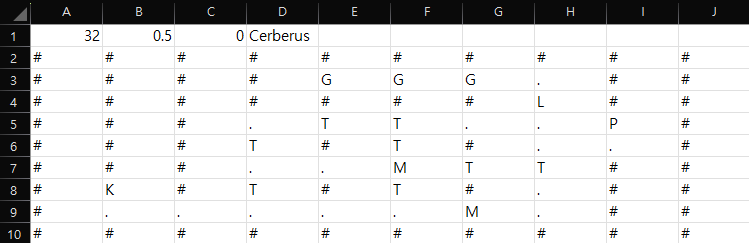
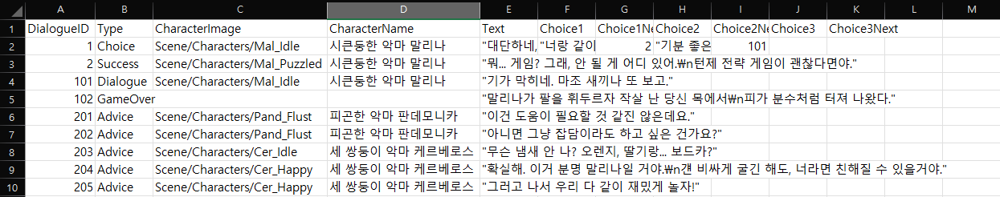

# Helltaker (헬테이커) 모작

- 그리드 기반 퍼즐 게임인 [Helltaker](https://store.steampowered.com/app/1289310/Helltaker/)의 Unity, C# 기반 모작입니다.
- 시연 영상 : [Youtube](https://youtu.be/DSWAkPyQHjs)
- 개발 인원 : 1명
- 제작 기간 : 3개월 (2025.10.21 - 2026.01.31)

# 핵심 기능

- CSV 기반 레벨 시스템
- 대화 및 선택지 시스템
- 그리드 기반 이동 및 충돌 처리
- 애니메이션 및 이펙트 연출
- 사운드 시스템

# 주요 시스템 상세

## CSV 기반 레벨 시스템

**레벨별 맵을 CSV 데이터로 관리하여 외부 데이터 수정만으로 구조를 변경할 수 있도록 설계했습니다.**

**CSV 구조**

- **1번째 줄**: 이동 횟수, 표시 오프셋(x, y), 골 캐릭터 이름
  - 예시) `32, 0.5, 0, Cerberus` - 32턴, 오프셋(x: 0.5, y: 0), 케르베로스
- **2번째 줄 이후**: 타일 맵 데이터
  - `P`: 플레이어, `G`: 골, `#`: 벽, `B`: 블록, `M`: 몬스터
  - `T`: 일반 가시, `U`: 올라온 가시, `D`: 내려간 가시
  - `K`: 열쇠, `L`: 자물쇠, `.`: 빈 공간

**LevelManager.cs**에서 CSV를 파싱해 그리드 좌표별로 해당하는 프리팹을 생성합니다.

## 대화 및 선택지 시스템

**대화 데이터를 CSV로 관리하며, 선택지 ID 범위로 대화 타입과 분기를 자동 판별합니다.**

**CSV 구조**

- **DialogueID**: 대화 고유 번호 (~99: 선택지와 정답 분기, 100~199: 오답 분기, 200~299: 힌트)
- **Type**: `Dialogue`(일반 대화), `Choice`(선택지), `Success`(클리어), `GameOver`(게임 오버), `Advice`(힌트)
- **CharacterImage, CharacterName, Text**: 캐릭터 이미지 경로, 이름, 대사
- **Choice1~3, Choice1Next~3Next**: 선택지 텍스트와 다음 대화 ID

**DialogueManager.cs**에서 CSV를 파싱해 `DialogueNode`구조체로 관리하며, 선택지 선택시 ID 범위로 정답/오답을 분기 처리합니다.

## 그리드 기반 이동 및 충돌 처리

**GridManager.cs**에서 좌표별 오브젝트를 `Dictionary<Vector2Int, List<GameObject>>`로 관리하며, 플레이어와 다른 오브젝트 간 상호작용을 중재합니다.

**주요 기능**

- **월드 좌표 <-> 그리드 좌표 변환**: `WorldToGrid(), GridToWorld()`
- **이동 가능 여부 검사**: `IsPositionBlocked()` - Wall 태그 포함시 이동 불가
- **페널티 타일 검사**: `IsPositionPunished()` - ThornNormal, ThornUp 태그 포함시 이동 횟수 페널티
- **밀 수 있는 오브젝트 확인**: `GetPushableAt()` - Block, Monster, LockBox 태그 여부 확인

## 애니메이션 및 이펙트 연출

### PlayerAnimator.cs

- Animator State Machine으로 Move/Kick 애니메이션 제어
- `IsAnimating` 프로퍼티로 애니메이션 재생 중 중복 입력 방지
- DOTween을 이용한 피격 이펙트 연출 (`FlashDamage()`)

### PlayerDeathAnimator.cs

- 스프라이트 시퀀스로 사망 애니메이션 구현
- 프레임별 스프라이트 배열을 `frameInterval` 간격으로 순차 재생
- 다른 오브젝트를 가릴 수 있게 월드 좌표를 스크린 좌표로 변환해 UI Canvas에 배치

### EffectManager.cs

- 이펙트 프리팹을 그리드 좌표 기반으로 생성
- `EffectType` enum으로 이펙트 종류 관리
- 그리드 좌표를 이펙트를 표시할 월드 좌표로 변환 후 생성 (`PlayEffectAtGrid()`)
- 두 그리드 사이 지점에 이펙트 생성 (`PlayEffectBetweenGrids()`)

## 사운드 시스템

**AudioManager.cs**에서 BGM과 SFX를 타입별로 관리합니다.

**주요 기능**

- **BGMType / SFXType enum**: 사운드를 타입별로 관리
- **볼륨 조절**: `SetBGMVolume()`, `SetSFXVolume()`으로 런타임에도 조정 가능
- **BGM과 게임 상태 연동**: Opening -> Game -> Ending 상태 전환시 자동으로 BGM 변경
- **액션별 SFX 재생**: 이동, 킥, 피격, 대화 등 각 액션마다 적절한 효과음 재생

# 기술 스택

- Unity 6000.2.8f1
- DOTween 1.2.790
- CSV 파싱 (레벨 / 대화 시스템 관리)

# 파일 구조

- Scripts/
  - Managers/    - 게임 전체 시스템 관리
    - GameManager.cs
    - LevelManager.cs
    - GridManager.cs
    - DialogueManager.cs
    - AudioManager.cs
    - EffectManager.cs
    - InputManager.cs
  - Animator/    - 연출 및 애니메이션 제어
    - PlayerAnimator.cs
    - PlayerDeathAnimator.cs
  - Utils/     - 오브젝트 동작 및 헬퍼 유틸리티
- Resources/
  - Dialogues/    - 대화 데이터 (CSV)
    - Opening.csv
    - Stage1.csv ~ Stage7.csv
    - Ending.csv
  - Stages/    - 맵 데이터 (CSV) 
    - Stage1.csv ~ Stage7.csv

# 플레이 방법

## 게임 목표

- 각 레벨에서 주어진 행동 포인트 안에 골 캐릭터 주변 타일로 도달해야 합니다.
  - 블럭과 몬스터는 주변에서 걷어차 밀어낼 수 있으며, 몬스터는 벽 방향으로 걷어차 제거할 수 있습니다.
  - 가시에 찔리면 행동 포인트가 한 번에 2씩 줄어듭니다.
  - 열쇠 아이템을 얻은 뒤 자물쇠 위치로 이동하면 자물쇠가 사라집니다.
- 골 캐릭터 주변에 도착하면 대화 창이 열리며 선택지가 제시됩니다.
  - 맞는 선택지를 고르면 다음 스테이지로 넘어가며, 틀린 선택지를 고르면 그 레벨을 다시 시작합니다.
- 총 7개의 레벨을 마치면 게임이 완전히 클리어됩니다.

## 조작키 (키보드 / 게임패드)

- 이동, 선택 : 방향키 / L 스틱
- 넘기기, 확인 : Enter / A 버튼
- 퍼즐 스킵 : Esc / B 버튼
- 재시작 : R키 / RB 버튼
- 힌트 : L키 / LB 버튼
